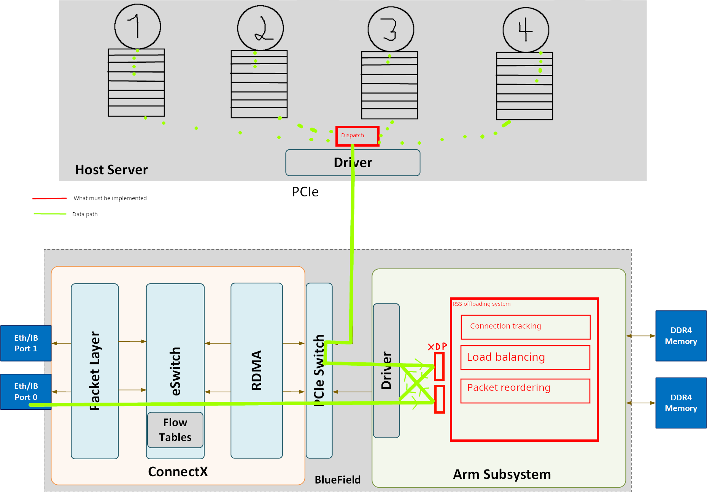

# Master Thesis

This is the repository containing code for my Master Thesis

## Overview

My work consists into offloading the balancing mechanism of RSS++ into a NVIDIA Bluefield-2 Smart-NIC. The main idea is to dispatch packets equally among cores while ensuring Flow-to-core affinity.

- **XDP programs** : Allows counting packets and bypassing the ARM Subsystem kernel on the data path.
- **RSS Offloading System** : Contains the offloading logic
  - **Connection Tracking** : Keeps track of connections and count packets
  - **Load balancing** : Based on connection tracking information, decide whether a flow must be moved from a core to another
  - **Packer reordering** : Reorders packets to improve cache efficiency
- **Dispatching** : On the host, dispatch packets among cores accordingly to what has been decided on the NIC and ensure that each core starts processing new flows only when there isn't any waiting packets in other queues.